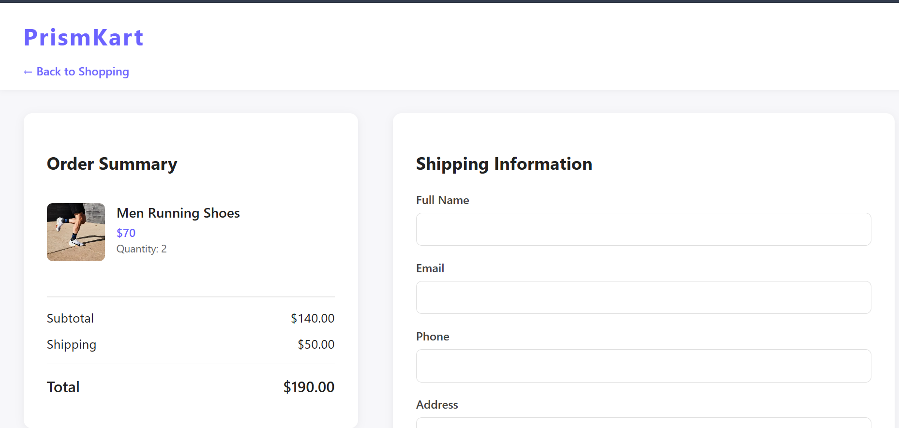

# PrismKart - Modern E-commerce Demo

A modern e-commerce demo application showcasing product listing, filtering, cart management, and checkout functionality.

## Features

- **Product Listing**
  - Grid layout with product cards
  - Product images, names, prices, and categories
  - Quick add to cart functionality
  - Product details modal on click

- **Filtering & Sorting**
  - Category-based filtering
  - Search by product name
  - Price sorting (low to high / high to low)

- **Shopping Cart**
  - Slide-in cart sidebar
  - Add/remove products
  - Real-time quantity updates
  - Cart total calculation
  - Persistent cart data using localStorage

- **Checkout Process**
  - Detailed order summary
  - Dynamic shipping cost calculation
  - Free shipping on orders above ₹500
  - Shipping information form
  - Order success confirmation
  - Responsive design for all devices

## Technologies Used

- HTML5
- CSS3 (with Flexbox and Grid)
- Vanilla JavaScript
- LocalStorage for data persistence

## Getting Started

1. Clone the repository
2. Open `index.html` in your browser
3. Browse products, add them to cart
4. Click "Proceed to Checkout" to test the checkout flow

## Project Structure

```
PrismKart/
├── index.html          # Main product listing page
├── checkout.html       # Checkout page
├── styles.css         # Main styles
├── checkout.css       # Checkout-specific styles
├── script.js         # Main JavaScript
├── checkout.js       # Checkout functionality
└── README.md         # Project documentation
```

## Features in Detail

### Shopping Cart
- Real-time cart updates
- Quantity management
- Persistent cart data
- Smooth animations

### Checkout Process
- Order summary with product details
- Dynamic shipping cost calculation
- Free shipping threshold at ₹500
- Form validation
- Success confirmation modal

## Future Enhancements

- User authentication
- Payment integration
- Order history
- Wishlist functionality
- Product reviews and ratings

## Screenshot


## Live Demo
[View Live](https://9-prismkart.vercel.app/) 

## How to Run
1. Download or clone this repository.
2. Open `index.html` in your browser.

## Add to Cart Functionality

This project now includes a fully frontend cart system:

- Each product card has an "Add to Cart" button.
- Click the cart icon (🛒) in the header to open the cart sidebar.
- The cart shows all selected items, their quantity, and the total price.
- Remove items from the cart with the ❌ button.
- Cart state is managed entirely in the browser (no backend required).

**How to use:**
1. Browse the product grid.
2. Click "Add to Cart" on any product.
3. Open the cart from the header to view or remove items.

